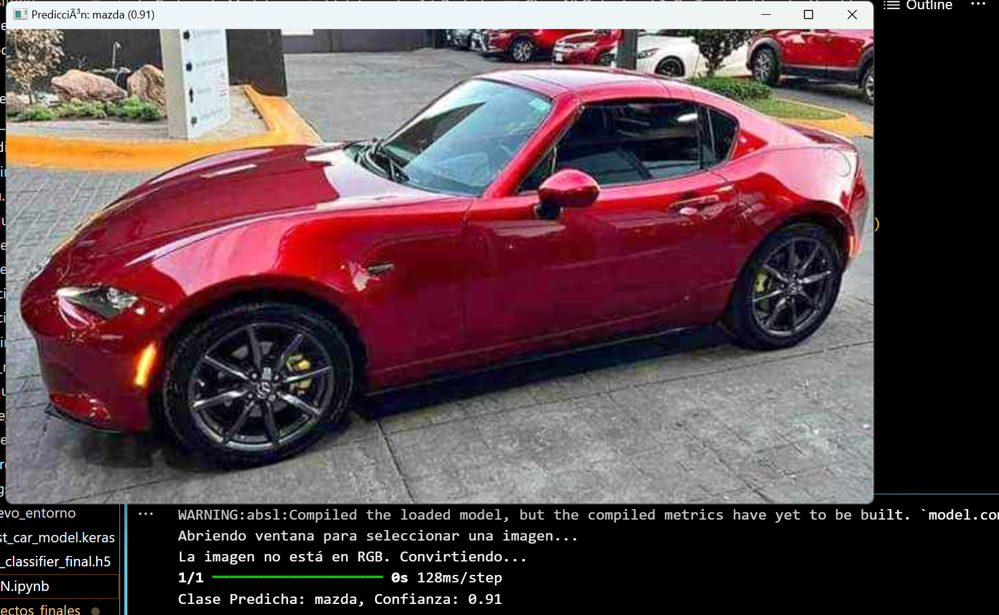
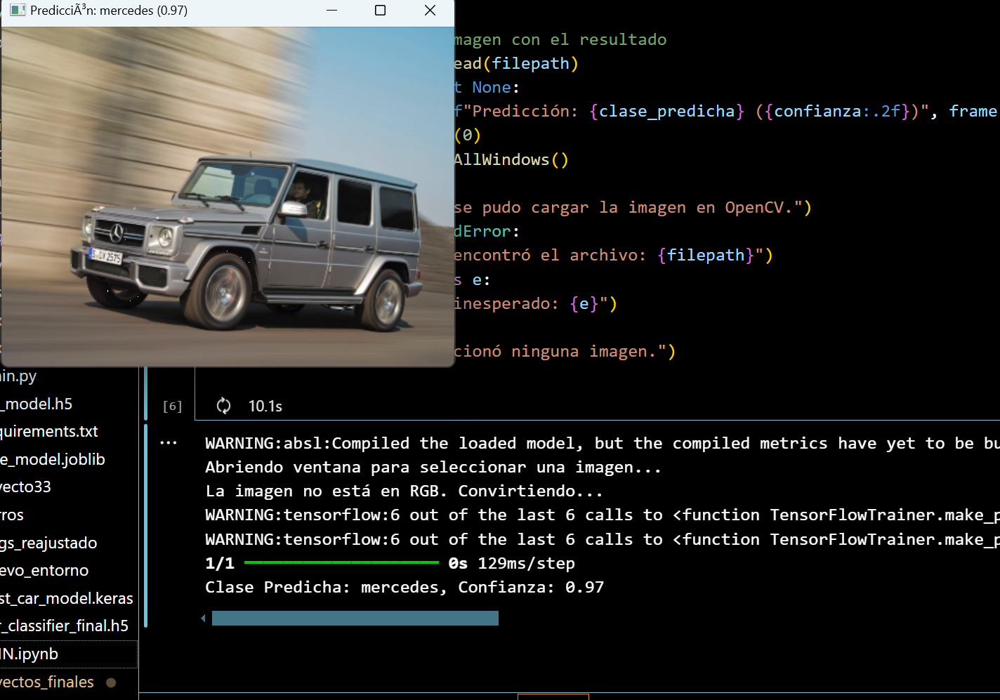
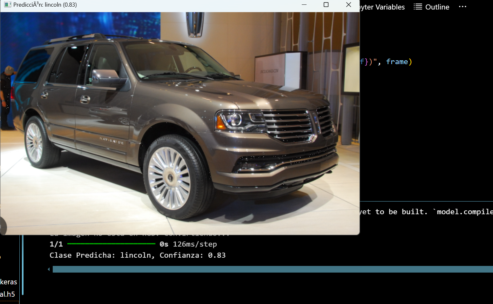
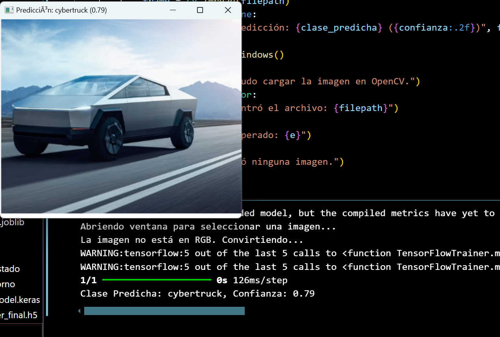
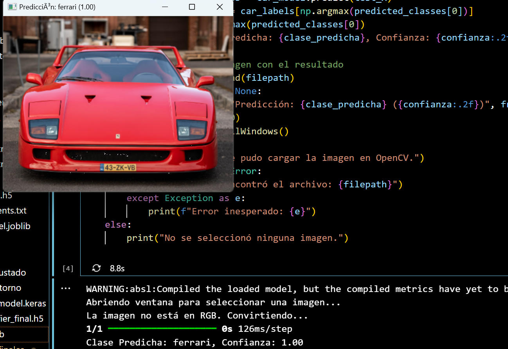

# IA-2024
# Arturo Navarro Velázquez

## Contenido
1. [Funcionamiento de las redes CNN](#funcionamiento-de-las-redes-cnn)
2. [Modelos de carros](#modelos-de-carros)
3. [Explicación del código para obtener el data set](#explicación-del-código-para-obtener-el-data-set)
4. [Entrenamiento del modelo CNN](#entrenamiento-del-modelo-cnn)
    1. [Creación de etiquetas](#creación-de-etiquetas)
    2. [Creamos Sets de Entrenamiento y Test](#creamos-sets-de-entrenamiento-y-test)
    3. [Proceso One-hot Encoding](#proceso-one-hot-encoding)
    4. [Entrenamiento del modelo](#entrenamiento-del-modelo)
5. [Código para ejecutar el CNN](#código-para-ejecutar-el-cnn)
4. [Resultados](#resultados)

# Proyecto 2 - CNN 

El siguiente programa realizará el reconocimiento de en base a 4 modelos diferentes de carros en el que deberá identificar qué modelo es el que se le entrega, para ello se empleará el manejao de **las redes neuronales convolucionales**.

## Funcionamiento de las redes CNN

Las redes neuronales convolucionales pueden tener decenas o cientos de capas, y cada una de ellas aprende a detectar diferentes características de una imagen. Se aplican filtros a las imágenes de entrenamiento con distintas resoluciones, y la salida resultante de convolucionar cada imagen se emplea como entrada para la siguiente capa. Los filtros pueden comenzar como características muy simples, tales como brillo y bordes, e ir creciendo en complejidad hasta convertirse en características que definen el objeto de forma singular. [Fuente](https://la.mathworks.com/discovery/convolutional-neural-network.html)

## Modelos de carros

Los carros que va detectar el programa son siguientes:

- Ferrari
- Mercedez
- Lincoln
- Cybertrunk
- Mazda

## Explicación del código para obtener el data set

El primer paso consistió en desarrollar un script de scraping para obtener de manera masiva las imágenes de cada uno de los modelos de automóviles mencionados previamente.

Primeramente se instalaron las librerias selenium.

Luego se definió la siguiente función:

``` python

from selenium import webdriver
from selenium.webdriver.common.by import By
from selenium.webdriver.chrome.service import Service
import time
import os
import requests


def download_images(search_term, num_images, output_folder):
    # Configura el WebDriver con Service
    service = Service("C:/Users/anava/Desktop/IA 2024/repositorio/selenium-image-scraper/chromedriver-win64/chromedriver.exe")
    driver = webdriver.Chrome(service=service)

    try:
        driver.get(f"https://www.google.com/search?q={search_term}&tbm=isch")
        os.makedirs(output_folder, exist_ok=True)

        # Almacena URLs de imágenes
        image_urls = set()
        start_time = time.time()  # Tiempo inicial para controlar el límite
        timeout = 4600  # Tiempo límite (1 hora) para la descarga de imágenes

```

La varible 'service' ejecuta la ubicación del servicio para realizar el scraping. 

``` python

 try:
        driver.get(f"https://www.google.com/search?q={search_term}&tbm=isch")
        os.makedirs(output_folder, exist_ok=True)

        # Almacena URLs de imágenes
        image_urls = set()
        start_time = time.time()  # Tiempo inicial para controlar el límite
        timeout = 4600  # Tiempo límite (1 hora) para la descarga de imágenes

        # Verifica imágenes existentes en la carpeta
        existing_files = set(os.listdir(output_folder))
        print(f"Archivos existentes: {len(existing_files)}")

        while len(image_urls) < num_images:
            if time.time() - start_time > timeout:
                print(f"Tiempo límite alcanzado para {search_term}. Descarga detenida.")
                break

            # Realiza el scroll para cargar más imágenes
            driver.execute_script("window.scrollTo(0, document.body.scrollHeight);")
            time.sleep(4)  # Aumenta el tiempo de espera para cargar más imágenes

            # Intenta cargar más imágenes haciendo clic en "Mostrar más resultados" si está presente
            try:
                button = driver.find_element(By.CSS_SELECTOR, ".mye4qd")  # Selector para "Mostrar más resultados"
                button.click()
                time.sleep(7)
            except:
                print("No se encontró el botón de 'Mostrar más resultados'. Continuando...")

            # Encuentra imágenes en la página
            images = driver.find_elements(By.TAG_NAME, "img")
            print(f"Imágenes encontradas en esta iteración: {len(images)}")

            for img in images:
                try:
                    src = img.get_attribute("src") or img.get_attribute("data-src")
                    if src and src.startswith("http"):
                        image_urls.add(src)
                        if len(image_urls) >= num_images:
                            break
                except Exception as e:
                    print(f"Error al obtener URL de imagen: {e}")

            print(f"Progreso: {len(image_urls)} imágenes recolectadas de {num_images} deseadas.")

        print(f"Total de URLs recolectadas: {len(image_urls)}")

        # Descargar imágenes
        for i, url in enumerate(image_urls):
            try:
                # Genera el nombre del archivo
                file_name = f"{search_term.replace(' ', '_')}_{i}.jpg"
                file_path = f"{output_folder}/{file_name}"

                # Verifica si el archivo ya existe
                if file_name in existing_files:
                    print(f"Imagen ya existe: {file_path}, saltando...")
                    continue

                # Descarga la imagen si no está duplicada
                response = requests.get(url, timeout=10)
                with open(file_path, "wb") as file:
                    file.write(response.content)
                print(f"Imagen guardada: {file_path}")
            except Exception as e:
                print(f"Error al descargar imagen {url}: {e}")

    finally:
        # Cierra el navegador incluso si ocurre un error
        driver.quit()
        print(f"Navegador cerrado para {search_term}.")

# Configuración de búsqueda y descarga
if __name__ == "__main__":
    # Lista de términos de búsqueda: Lincoln Navigator de 2008 a 2025
    years = list(range(2008, 2026))  # Genera los años de 2008 a 2025
    car_models = [f"Mercedez clase G {year}" for year in years]

    # Número de imágenes por modelo
    num_images_per_model = 100  # Puedes cambiar este valor según tus necesidades

    # Carpeta de salida única
    output_folder = "../images/lincoln"

    for model in car_models:
        print(f"Descargando imágenes de: {model}")
        download_images(model, num_images_per_model, output_folder)


```

El siguiente código ejecuta un proceso de scraping que realiza a consultas masivas y a traves la ruta
'search_term' y en la función main se define la ruta en donde se van a guardar la rutas.

## Entrenamiento del modelo CNN

Una vez obtenido ya el dataset, ahora si procederemos entrenar el modelo 
Los primero definimos las librerias que se van a utilizar.

``` python
import numpy as np
import os
import re
import matplotlib.pyplot as plt
%matplotlib inline
from sklearn.model_selection import train_test_split
from sklearn.metrics import classification_report

# Configuración básica para trabajar con el dataset de coches
print("Importaciones listas y configuradas para clasificar coches.")

import tensorflow as tf
from tensorflow.keras.utils import to_categorical
from tensorflow.keras.models import Sequential, Model
from tensorflow.keras.layers import Input, Dense, Dropout, Flatten, BatchNormalization
from tensorflow.keras.layers import Conv2D, MaxPooling2D, LeakyReLU, Activation
from tensorflow.keras.optimizers import SGD

# Configuración para redes neuronales con TensorFlow y Keras
print("Versión de TensorFlow:", tf.__version__)
print("Keras está integrado con TensorFlow.")
print("Configuración lista para trabajar con TensorFlow y Keras.")

# Procesar cada subcarpeta en la carpeta de origen
for class_name in os.listdir(source_path):
    class_path = os.path.join(source_path, class_name)
    if not os.path.isdir(class_path):
        continue

    # Crear directorio para cada clase en la carpeta de destino
    output_class_path = os.path.join(destination_path, class_name)
    os.makedirs(output_class_path, exist_ok=True)

    # Redimensionar y mover imágenes
    for img_name in os.listdir(class_path):
        img_path = os.path.join(class_path, img_name)
        try:
            with Image.open(img_path) as img:
                # Convertir a RGB (por si hay imágenes en otro modo como escala de grises)
                img = img.convert("RGB")
                # Redimensionar y guardar
                img_resized = img.resize(target_size)
                img_resized.save(os.path.join(output_class_path, img_name))
        except Exception as e:
            print(f"Error al procesar {img_path}: {e}")
``` 

Las imágenes se redimensionan para asegurar que todas tengan el mismo tamaño, en este caso, 150x150x3 (altura, anchura, canales de color). Si alguna imagen no tiene el tamaño esperado, se redimensiona utilizando la función resize de la librería skimage.transform.

Posteriormente las imágenes se normalizan convirtiéndolas a tipo float32 y escalando los valores de píxeles entre 0 y 1. Esto es común para redes neuronales, ya que facilita la convergencia durante el entrenamiento.

### Creación de etiquetas

``` python
labels = []
indice = 0

# Generar las etiquetas basadas en el conteo de imágenes por directorio
for cantidad in dircount:
    for i in range(cantidad):
        labels.append(indice)  # Asignar la etiqueta correspondiente al índice del directorio
    indice += 1

print("Cantidad de etiquetas creadas: ", len(labels))

carros = []  # Lista para almacenar los nombres de las clases
indice = 0

# Extraer los nombres de los directorios como clases
for directorio in directories:
    name = os.path.basename(directorio)  # Extraer el nombre del directorio directamente
    print(indice, name)  # Imprimir índice y nombre del directorio
    carros.append(name)  # Agregar el nombre del directorio a la lista
    indice += 1
```

**Salida del código**

0 cybertruck <br>
1 ferrari <br>
2 lincoln <br>
3 mazda <br>
4 mercedez <br>

### Creamos Sets de Entrenamiento y Test


``` python
from sklearn.model_selection import train_test_split

# Dividir los datos en conjuntos de entrenamiento y prueba
train_X, test_X, train_Y, test_Y = train_test_split(X, y, test_size=0.2, random_state=42)

# Mostrar las formas de los conjuntos de datos
print('Forma de los datos de entrenamiento:', train_X.shape, train_Y.shape)
print('Forma de los datos de prueba:', test_X.shape, test_Y.shape)

# Asegúrate de que las etiquetas estén disponibles
car_labels = ["cybertruck", "ferrari", "lincoln", "mazda", "mercedez"]

plt.figure(figsize=[5, 5])

# Mostrar la primera imagen en el conjunto de entrenamiento
plt.subplot(121)
plt.imshow(train_X[0].astype(np.uint8))  # Asegurarse de mostrar la imagen correctamente
train_label_index = train_Y[0]  # Directamente la etiqueta numérica
plt.title(f"Etiqueta Real: {car_labels[train_label_index]}")

# Mostrar la primera imagen en el conjunto de prueba
plt.subplot(122)
plt.imshow(test_X[0].astype(np.uint8))  # Asegurarse de mostrar la imagen correctamente
test_label_index = test_Y[0]  # Directamente la etiqueta numérica
plt.title(f"Etiqueta Real: {car_labels[test_label_index]}")

```
**Salida del código**

Forma de los datos de entrenamiento: (41348, 150, 150, 3) (41348,)
Forma de los datos de prueba: (10338, 150, 150, 3) (10338,)

### Proceso One-hot Encoding

La codificación one-hot es un método de conversión de variables categóricas en un formato que se puede proporcionar a los algoritmos de aprendizaje automático para mejorar la predicción. 

En esta etapa, las etiquetas de las clases se convierten a formato one-hot usando la función to_categorical de Keras. Este tipo de codificación es necesario para la clasificación en redes neuronales, ya que permite representar las clases como vectores binarios.

**Salida del código**

Número de clases (nClasses): 5 <br>
Forma de train_Y_one_hot: (41348, 5) <br>
Forma de test_Y_one_hot: (10338, 5) <br>
Etiqueta original: 3 <br>
Después de la conversión a one-hot: [0. 0. 0. 1. 0.]<br>


### Creación del modelo CNN
``` python

from keras.callbacks import EarlyStopping, ReduceLROnPlateau

# Declarar las variables con los parámetros de configuración de la red
INIT_LR = 1e-3  # Tasa de aprendizaje inicial ajustada para velocidad y estabilidad
epochs = 50  # Reducido a 40 para limitar el tiempo de entrenamiento
batch_size = 128  # Tamaño de lote eficiente para memoria y rendimiento

# Callback para detener el entrenamiento si no mejora
early_stop = EarlyStopping(
    monitor='val_loss',
    patience=5,  # Detiene si no mejora en 5 épocas consecutivas
    restore_best_weights=True
)

# Callback para reducir el learning rate si la validación no mejora
reduce_lr = ReduceLROnPlateau(
    monitor='val_loss',
    factor=0.5,  # Reduce el learning rate a la mitad
    patience=3,  # Espera 3 épocas sin mejora
    min_lr=1e-6  # Learning rate mínimo
)

# Mostrar los parámetros configurados
print(f"Tasa de aprendizaje inicial: {INIT_LR}")
print(f"Número de épocas: {epochs}")
print(f"Tamaño de batch: {batch_size}")

```

En este proceso obtenemos la tabla de etiquetas con los valores de sus parámetros.

**Salida del código**

| Layer (type)                     | Output Shape            | Param #       |
|-----------------------------------|-------------------------|---------------|
| conv2d (Conv2D)                  | (None, 150, 150, 32)    | 2,432         |
| batch_normalization (BatchNormalization) | (None, 150, 150, 32) | 128           |
| leaky_re_lu (LeakyReLU)          | (None, 150, 150, 32)    | 0             |
| max_pooling2d (MaxPooling2D)     | (None, 75, 75, 32)      | 0             |
| dropout (Dropout)                | (None, 75, 75, 32)      | 0             |
| conv2d_1 (Conv2D)                | (None, 75, 75, 64)      | 18,496        |
| batch_normalization_1 (BatchNormalization) | (None, 75, 75, 64)  | 256           |
| leaky_re_lu_1 (LeakyReLU)        | (None, 75, 75, 64)      | 0             |
| max_pooling2d_1 (MaxPooling2D)   | (None, 38, 38, 64)      | 0             |
| dropout_1 (Dropout)              | (None, 38, 38, 64)      | 0             |
| conv2d_2 (Conv2D)                | (None, 38, 38, 128)     | 73,856        |
| batch_normalization_2 (BatchNormalization) | (None, 38, 38, 128) | 512           |
| leaky_re_lu_2 (LeakyReLU)        | (None, 38, 38, 128)     | 0             |
| max_pooling2d_2 (MaxPooling2D)   | (None, 19, 19, 128)     | 0             |
| dropout_2 (Dropout)              | (None, 19, 19, 128)     | 0             |
| conv2d_3 (Conv2D)                | (None, 19, 19, 256)     | 295,168       |
| batch_normalization_3 (BatchNormalization) | (None, 19, 19, 256) | 1,024         |
| leaky_re_lu_3 (LeakyReLU)        | (None, 19, 19, 256)     | 0             |
| max_pooling2d_3 (MaxPooling2D)   | (None, 10, 10, 256)     | 0             |
| dropout_3 (Dropout)              | (None, 10, 10, 256)     | 0             |
| flatten (Flatten)                | (None, 25600)           | 0             |
| dense (Dense)                    | (None, 512)             | 13,107,712    |
| batch_normalization_4 (BatchNormalization) | (None, 512)         | 2,048         |
| leaky_re_lu_4 (LeakyReLU)        | (None, 512)             | 0             |
| dropout_4 (Dropout)              | (None, 512)             | 0             |
| dense_1 (Dense)                  | (None, 128)             | 65,664        |
| batch_normalization_5 (BatchNormalization) | (None, 128)         | 512           |
| leaky_re_lu_5 (LeakyReLU)        | (None, 128)             | 0             |
| dropout_5 (Dropout)              | (None, 128)             | 0             |
| dense_2 (Dense)                  | (None, 5)               | 645           |

**Total params**: 13,568,453 (51.76 MB)  
**Trainable params**: 13,566,213 (51.75 MB)  
**Non-trainable params**: 2,240 (8.75 KB)


### Entrenamiento del modelo

``` python

from tensorflow.keras.callbacks import EarlyStopping, ModelCheckpoint, ReduceLROnPlateau

# Definir callbacks
early_stopping = EarlyStopping(
    monitor='val_loss', 
    patience=5,  # Detener si no mejora después de 5 épocas
    restore_best_weights=True
)

model_checkpoint = ModelCheckpoint(
    'best_car_model.keras',  # Cambiar extensión a .keras para TF >= 2.11
    monitor='val_loss', 
    save_best_only=True
)

reduce_lr = ReduceLROnPlateau(
    monitor='val_loss', 
    factor=0.2,  # Reducir la tasa de aprendizaje en un factor de 0.2
    patience=3,  # Reducir si no mejora en 3 épocas
    min_lr=1e-6  # Tasa de aprendizaje mínima
)

# Entrenar el modelo
car_train = car_model.fit(
    train_X, train_label,               # Conjunto de entrenamiento (imágenes y etiquetas one-hot)
    batch_size=batch_size,              # Tamaño de lote
    epochs=epochs,                      # Número de épocas
    verbose=1,                          # Nivel de detalle en la salida
    validation_data=(valid_X, valid_label),  # Conjunto de validación
    callbacks=[early_stopping, model_checkpoint, reduce_lr]  # Añadir callbacks
)

print("Entrenamiento completado.")

```

En este paso, entrenamos el modelo durante 259 épocas para cada etiqueta. Al finalizar, obtenemos como salida el archivo 'car_classifier_final.h5', el cual contiene la recopilación del entrenamiento de la red neuronal convolucional (CNN).

## Código para ejecutar el CNN

``` python

from skimage.transform import resize
import cv2 as cv
import matplotlib.pyplot as plt
import numpy as np
from keras.models import load_model
from tkinter import Tk, filedialog
from PIL import Image

# Función para abrir una ventana de selección de archivos
def seleccionar_imagen():
    root = Tk()
    root.withdraw()  # Ocultar la ventana principal de Tkinter
    archivo_seleccionado = filedialog.askopenfilename(
        title="Selecciona una imagen",
        filetypes=[("Archivos de imagen", "*.jpg;*.jpeg;*.png;*.bmp;*.tiff")]
    )
    return archivo_seleccionado


```
La función seleccionar imágen recibe como parámetros el la clase TK para la generar la ventana de salida y un arreglo de formatos de imágen para evitar que halla errores con archivos con pdfs.

Posteriormente se define un array de los las etiquetas que va tomar el clasificador a la hora de identicar el modelo del carro

``` python

# Cargar el modelo guardado
model_path = 'car_classifier_final.h5'  # Asegúrate de usar el nombre correcto del modelo guardado
car_model = load_model(model_path)


# Etiquetas de las clases (ajusta esta lista con las clases de tu modelo)
car_labels = ['cybertruck', 'ferrari', 'lincoln', 'mazda', 'mercedes']

# Tamaño esperado por el modelo (actualizado a 150x150)
expected_size = (150, 150)  # Redimensionar a 150x150

# Abrir ventana de selección de archivos
print("Abriendo ventana para seleccionar una imagen...")
filepath = seleccionar_imagen()

```

por último la variable filepath será la respuesta de la función ejecutará la lógica para crear la interfaz con la respuesta del clasificador

``` python

if filepath:
    try:
        # Leer y procesar la imagen seleccionada
        image = Image.open(filepath)

        # Convertir la imagen a RGB si no tiene 3 canales
        if image.mode != 'RGB':
            print("La imagen no está en RGB. Convirtiendo...")
            image = image.convert('RGB')

        # Redimensionar la imagen al tamaño esperado por el modelo
        image_resized = image.resize(expected_size)  # Redimensionar a 150x150
        image_array = np.array(image_resized, dtype=np.float32) / 255.0  # Normalizar

        # Expandir las dimensiones para que sea compatible con el modelo
        test_X = np.expand_dims(image_array, axis=0)  # Forma resultante: (1, 150, 150, 3)

        # Realizar predicción
        predicted_classes = car_model.predict(test_X)
        clase_predicha = car_labels[np.argmax(predicted_classes[0])]
        confianza = np.max(predicted_classes[0])
        print(f"Clase Predicha: {clase_predicha}, Confianza: {confianza:.2f}")

        # Mostrar la imagen con el resultado
        frame = cv.imread(filepath)
        if frame is not None:
            cv.imshow(f"Predicción: {clase_predicha} ({confianza:.2f})", frame)
            cv.waitKey(0)
            cv.destroyAllWindows()
        else:
            print("No se pudo cargar la imagen en OpenCV.")
    except FileNotFoundError:
        print(f"No se encontró el archivo: {filepath}")
    except Exception as e:
        print(f"Error inesperado: {e}")
else:
    print("No se seleccionó ninguna imagen.")

```
## Resultados

Las siguientes imágenes son los resultados del programa





