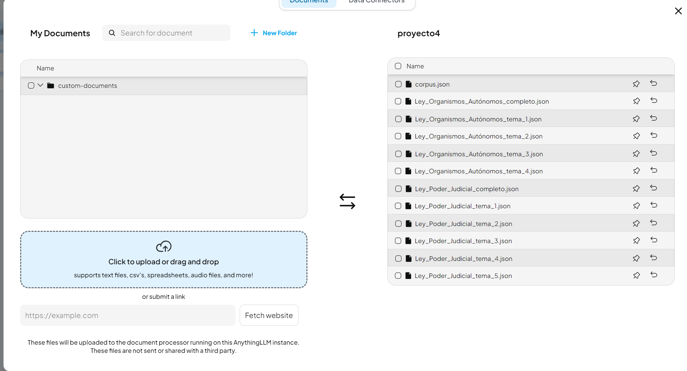
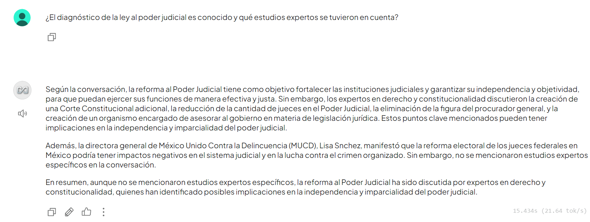
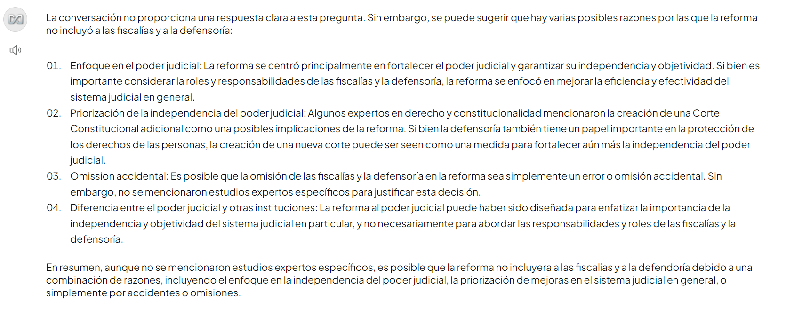
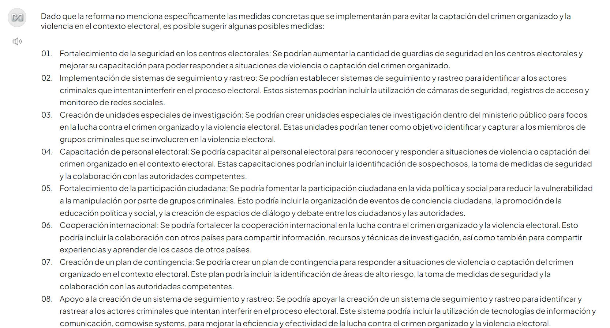
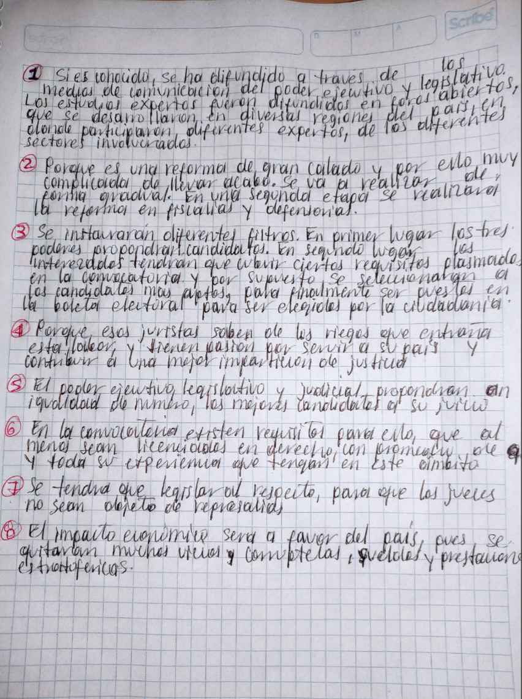
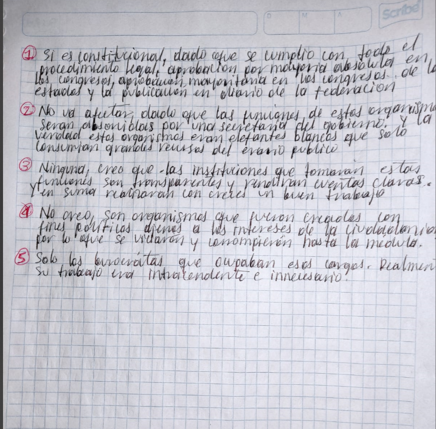

#  En la rama main se encuentra el proyeto 1


# Proyecto 4

# link de los videos
https://drive.google.com/file/d/1L0ExRfPyYFwm4-NPwjzbkCcQ9hPXc-dL/view?usp=sharing 

https://drive.google.com/file/d/1wFfxRzrFpLqCZJ1QcXWy5v2-YWnaL6B6/view?usp=sharing 


# Proceso Completo para la Implementación de un Modelo LLM con AnythingLLM

Este documento detalla cada paso realizado para implementar un modelo de lenguaje (LLM) utilizando herramientas como Ollama y AnythingLLM, desde la extracción de contenido en videos, scrapeo de páginas web, generación de embeddings, hasta la integración final en AnythingLLM.


## 1. Descarga de Videos y Conversión de Audio a Texto

### Herramientas Utilizadas:
- **yt-dlp**: Para descargar videos desde YouTube.
- **Whisper**: Para transcribir audio a texto.

### Pasos:
1. **Instalar `yt-dlp`**:
   ```bash
   pip install yt-dlp
   ```
2. **Descargar videos desde YouTube**:
   ```bash
   yt-dlp <URL_DEL_VIDEO>
   ```
3. **Extraer audio del video descargado**:
   ```bash
   yt-dlp --extract-audio --audio-format wav <URL_DEL_VIDEO>
   ```
4. **Transcripción del audio a texto con Whisper**:
   ```bash
   pip install openai-whisper
   whisper <archivo_audio.wav> --language es --model base
   ```
5. **Revisar y guardar el archivo generado**:
   - Whisper genera un archivo `.txt` con el contenido transcrito.

---

## 2. Scrapeo de Información desde Google

### Herramientas Utilizadas:
- **googlesearch-python**: Para obtener enlaces relevantes desde Google.
- **BeautifulSoup**: Para extraer texto de las páginas web.

### Pasos:
1. **Buscar información en Google**:
   ```python
   from googlesearch import search

   query = "Reforma del Poder Judicial en México"
   for url in search(query, num=10, stop=10, pause=2):
       print(url)
   ```
2. **Extraer contenido de las URLs obtenidas**:
   ```python
   import requests
   from bs4 import BeautifulSoup

   def scrape_page(url):
       response = requests.get(url)
       soup = BeautifulSoup(response.text, "html.parser")
       paragraphs = soup.find_all("p")
       return "\n".join([p.text for p in paragraphs])

   urls = ["https://example.com"]
   for url in urls:
       print(scrape_page(url))
   ```
3. **Guardar el contenido extraído**:
   ```json
   [
       {
           "title": "Título de la página",
           "content": "Contenido de la página",
           "url": "https://example.com"
       }
   ]
   ```

---

## 3. Generación de Embeddings

### Herramienta Utilizada:
- **SentenceTransformers**: Para convertir textos en vectores numéricos.

### Pasos:
1. **Instalar las bibliotecas necesarias**:
   ```bash
   pip install sentence-transformers
   ```
2. **Script para generar embeddings**:
   ```python
   from sentence_transformers import SentenceTransformer
   import json

   model = SentenceTransformer("all-MiniLM-L6-v2")

   def generate_embeddings(data):
       for item in data:
           item["embedding"] = model.encode(item["content"]).tolist()
       return data

   with open("archivo.json", "r", encoding="utf-8") as f:
       data = json.load(f)

   enriched_data = generate_embeddings(data)

   with open("archivo_embeddings.json", "w", encoding="utf-8") as f:
       json.dump(enriched_data, f, ensure_ascii=False, indent=4)
   ```

---

## 4. Uso de Ollama para Resúmenes y Enriquecimiento

### Herramienta Utilizada:
- **Ollama**: Para generar resúmenes utilizando modelos como Llama2.

### Pasos:
1. **Instalar Ollama**:
   - Descarga e instala Ollama desde su sitio oficial.
2. **Cargar un modelo compatible**:
   ```bash
   ollama pull llama2
   ```
3. **Script para generar resúmenes con Ollama**:
   ```python
   import subprocess
   import json

   def query_ollama(prompt, model="llama2"):
       process = subprocess.run(
           ["ollama", "generate", "--model", model],
           input=prompt.encode("utf-8"),
           capture_output=True
       )
       return process.stdout.decode("utf-8").strip()

   def enrich_with_summaries(data):
       for item in data:
           prompt = f"Resume el siguiente texto: {item['content']}"
           item["summary"] = query_ollama(prompt)
       return data

   with open("archivo.json", "r", encoding="utf-8") as f:
       data = json.load(f)

   enriched_data = enrich_with_summaries(data)

   with open("archivo_enriched.json", "w", encoding="utf-8") as f:
       json.dump(enriched_data, f, ensure_ascii=False, indent=4)
   ```

---

## 5. Preparación de Datos para AnythingLLM

### Herramienta Utilizada:
- **AnythingLLM**: Para cargar los datos procesados y realizar consultas.

### Pasos:
1. **Formatear los datos**:
   ```python
   def prepare_for_anythingllm(data):
       prepared_data = []
       for item in data:
           prepared_data.append({
               "text": item["summary"],
               "metadata": {"source": item["url"]},
               "embedding": item["embedding"]
           })
       return prepared_data

   with open("archivo_enriched.json", "r", encoding="utf-8") as f:
       data = json.load(f)

   prepared_data = prepare_for_anythingllm(data)

   with open("archivo_anythingllm.json", "w", encoding="utf-8") as f:
       json.dump(prepared_data, f, ensure_ascii=False, indent=4)
   ```
2. **Subir los datos a AnythingLLM**:
   - Carga el archivo `archivo_anythingllm.json` al workspace de AnythingLLM.
3. **Configurar el modelo**:
   - Selecciona Ollama como proveedor del modelo.
   - Configura el prompt para que las respuestas sean exclusivamente en español:
     ```plaintext
     Dada la conversación anterior, el contexto relevante y una pregunta de seguimiento, responde exclusivamente en español.
     ```

---

## 6. Uso del Sistema

El modelo está listo para procesar consultas basadas en el contenido cargado
# Descripción de la Imagen

En la siguiente imagen se muestra la interfaz de  AnythingLLM. donde podemos observar la carga de nuestros documentos json:


 **Panel Derecho (proyecto4)**:
 "Aqui podemos ver todos los archivos que se cargaron producto de las tecnicas de scrapeo y analisis de texto
   - Incluye una lista de archivos JSON relacionados con leyes y reformas:
     - `corpus.json`
     - `Ley_Organismos_Autónomos_completo.json`
     - `Ley_Organismos_Autónomos_tema_1.json`
     - `Ley_Organismos_Autónomos_tema_2.json`
     - `Ley_Organismos_Autónomos_tema_3.json`
     - `Ley_Organismos_Autónomos_tema_4.json`
     - `Ley_Poder_Judicial_completo.json`
     - `Ley_Poder_Judicial_tema_1.json`
     - `Ley_Poder_Judicial_tema_2.json`
     - `Ley_Poder_Judicial_tema_3.json`
     - `Ley_Poder_Judicial_tema_4.json`
     - `Ley_Poder_Judicial_tema_5.json`
   - Cada archivo tiene opciones para gestión como mover o eliminar.


### En la siguiente imagen apreciamos todos los archivos json que cargamos a nuestro modelo



## Resultados
A qui podemos algunos resultados de lo quecontesto nuestro modelo a algunas preguntas









## Respuestas de las preguntas 
a continuacion en base a todo lo recolectado y a la informacion que me dio el modelo se contestaron las siguientes preguntas en orden, puesto que queria demostrar que no use ia para contestarlas las escribi a mano

# Preguntas para el Análisis de las Leyes

## Preguntas para la Ley del Poder Judicial
1. ¿El diagnóstico de la ley al poder judicial es conocido y qué estudios expertos se tuvieron en cuenta?
2. ¿Por qué la reforma no incluyó a las fiscalías y a la defensoría, limitándose solo al poder judicial?
3. ¿Qué medidas concretas se implementarán para evitar la captación del crimen organizado y la violencia en el contexto electoral?
4. ¿Cómo garantizar que juristas probos y honestos se animen a competir públicamente frente a los riesgos de la violencia?
5. ¿Cómo se conforman los comités de postulación?
6. ¿Cómo asegurar la carrera judicial?
7. ¿Cómo compatibilizar la incorporación de medidas para preservar la identidad de los jueces (conocidos en el sistema interamericano como "jueces sin rostro") con los estándares internacionales?
8. ¿Cómo impactará el costo económico de esta reforma en la promoción y el acceso a la justicia?

## Preguntas para la Ley de Organismos Autónomos
1. ¿Es constitucional esta ley, considerando que algunos organismos autónomos están establecidos en la Constitución?
2. ¿Cómo afectaría la eliminación de estos organismos a la transparencia y rendición de cuentas del gobierno?
3. ¿Qué funciones críticas podrían perder independencia y control al pasar al poder ejecutivo u otras instituciones?
4. ¿Existen alternativas para mejorar la eficiencia de los organismos autónomos sin eliminarlos?
5. ¿Qué sectores de la sociedad civil y grupos de interés se verían afectados por la desaparición de estos organismos?


## Respuestas




=======


