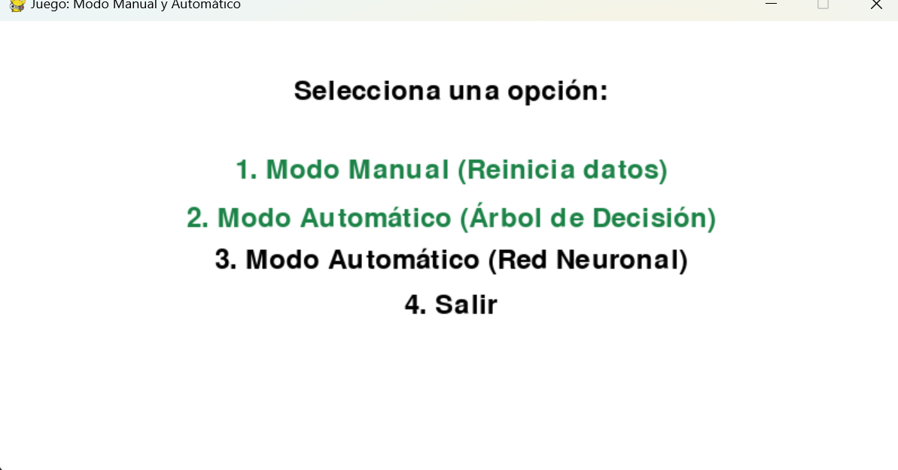
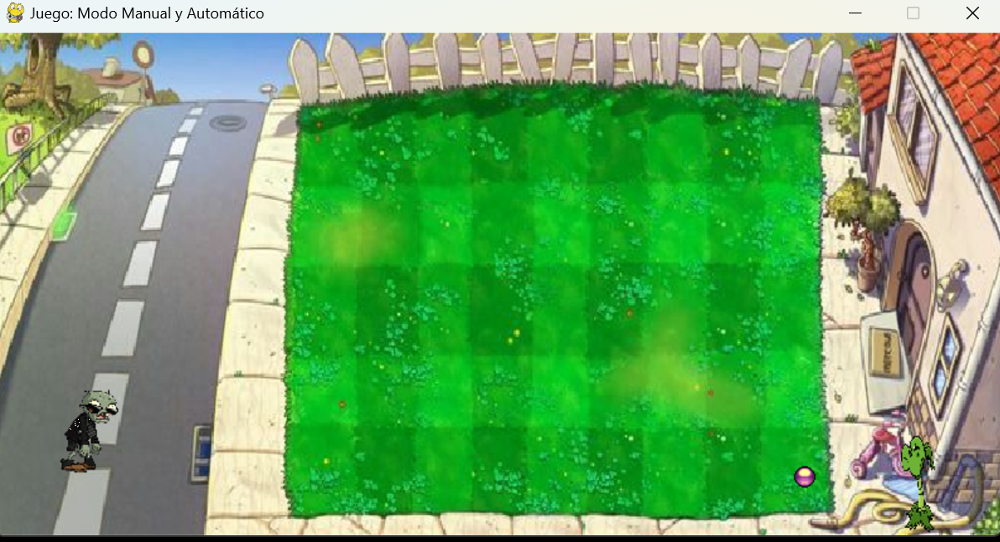
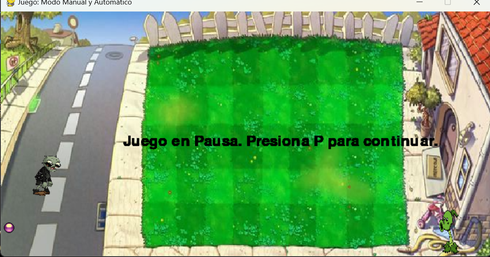
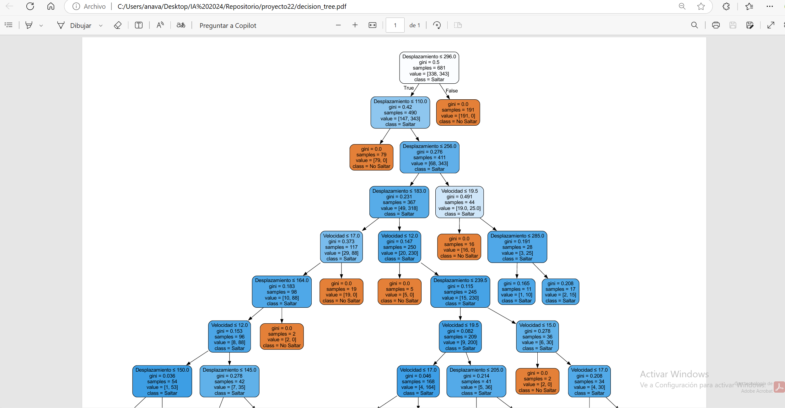
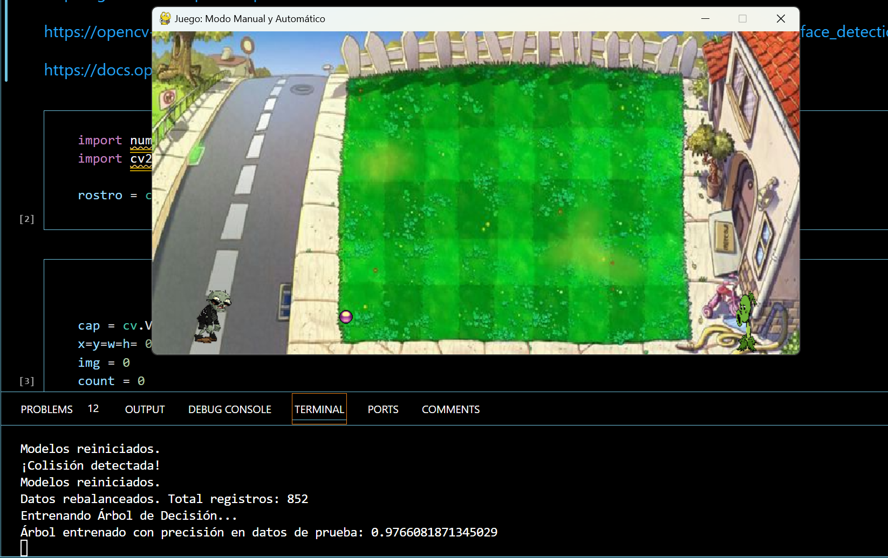
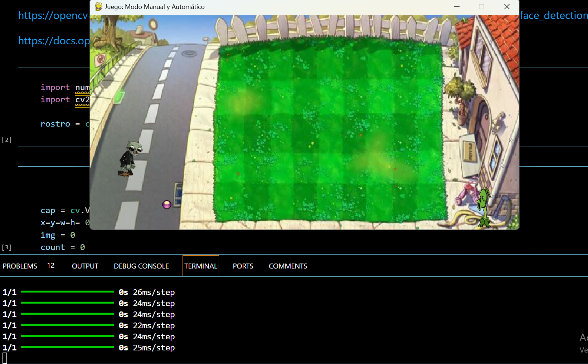

# IA-2024
# Arturo Navarro Velázquez

## Contenido
1. [Requerimientos ](#requerimientos)
2. [Explicación del código](#explicación-del-código)
3. [Entrenamientode la red neuronal](#entrenamientode-la-red-neuronal)
4. [Ejecución final del código](#ejecución-final-del-código)
5. [Resultados](#resultados)

# Proycto 3 - phaser

El siguiente código es la programación de un juego a través de la libreria pygame en el que debe el personaje aprender a esquivar usando la libreía train_test_split (Librería para el manejo de redes neuronales)

## Requerimientos

Instalar las libreías:
- pygame
- Sequential
- pandas
- train_test_split


## Explicación del código

Primeramente se hace la importación de las librerias y se denifen las variables para el escenarios, personajes del juegos.
El juego tendrá 2 modos un modo manual con el la red neural aprenderá de las acciones del jugador para aprender esquivar las pelotas

``` python

import pygame
import numpy as np
import pandas as pd
from tensorflow.keras.models import Sequential
from tensorflow.keras.layers import Dense
from sklearn.tree import DecisionTreeClassifier
from sklearn.model_selection import train_test_split
from sklearn.utils import resample
from sklearn.utils.validation import check_is_fitted
import random
import os

# Inicialización de Pygame
pygame.init()


# Dimensiones de la ventana
WIDTH, HEIGHT = 800, 400
window = pygame.display.set_mode((WIDTH, HEIGHT))
pygame.display.set_caption("Juego: Modo Manual y Automático")

# Colores
WHITE = (255, 255, 255)
RED = (255, 0, 0)
BLUE = (0, 0, 255)
BLACK = (0, 0, 0)
GREEN = (0, 255, 0)

# Recursos del juego
player_image = pygame.image.load("assets/player.png")
player_image = pygame.transform.scale(player_image, (50, 70))
ball_image = pygame.image.load("assets/ball.png")
background_image = pygame.image.load("assets/background.png")
background_image = pygame.transform.scale(background_image, (WIDTH, HEIGHT))
plant_image = pygame.image.load("assets/frames/frame13.png")  # Imagen de la planta
plant_image = pygame.transform.scale(plant_image, (80, 100))  # Escalar la planta


```

Tambien para darle más realismo se cargaron sonidos al juego

``` python

# Configurar música de fondo
pygame.mixer.music.load("assets/music/background_music.mp3")  # Ruta al archivo de música
pygame.mixer.music.set_volume(0.5)  # Ajustar volumen (0.0 a 1.0)
pygame.mixer.music.play(-1)  # Reproducir en bucle infinito (-1)


# Cargar efecto de sonido para el salto
jump_sound = pygame.mixer.Sound("assets/sounds/jump.mp3")  # Ruta al archivo del sonido
jump_sound.set_volume(0.7)  # Ajustar volumen del efecto

```

Posterirmente creamos las función para la funciones de para mostrar el menú, reiniciar el juego y crear modo automático

``` python

def mostrar_menu():
    window.fill(WHITE)  # Usa un color sólido

    titulo = menu_font.render("Selecciona una opción:", True, text_color)
    opcion1 = menu_font.render("1. Modo Manual (Reinicia datos)", True, highlight_color if modo_manual else text_color)
    opcion2_arbol = menu_font.render("2. Modo Automático (Árbol de Decisión)", True, highlight_color if usar_arbol else text_color)
    opcion3_red = menu_font.render("3. Modo Automático (Red Neuronal)", True, highlight_color if not usar_arbol else text_color)
    salir = menu_font.render("4. Salir", True, text_color)

    # Dibuja las opciones en la pantalla
    window.blit(titulo, (WIDTH // 2 - titulo.get_width() // 2, 50))
    window.blit(opcion1, (WIDTH // 2 - opcion1.get_width() // 2, 120))
    window.blit(opcion2_arbol, (WIDTH // 2 - opcion2_arbol.get_width() // 2, 160))
    window.blit(opcion3_red, (WIDTH // 2 - opcion3_red.get_width() // 2, 200))
    window.blit(salir, (WIDTH // 2 - salir.get_width() // 2, 240))

    pygame.display.flip()
```

Esta función mostrará una ventana con la opciones de modo de juego

``` python
def seleccionar_modo_automatico():
    global usar_arbol
    if len(data) < 10:
        print("Por favor, recoge más datos en Modo Manual antes de usar el Modo Automático.")
        return False
    entrenar_modelos()
    return True

```

Es función llama a entrerar_modelos() donde ser realiaz el proceso de la red neuronal

## Entrenamientode la red neuronal

Definimos un función para inicializar la red neuronal y otras para reajustar los datos de entrda

``` python

def inicializar_red_neuronal():
    global nn_model
    nn_model = Sequential([
        Dense(16, input_dim=2, activation='relu'),  # Aumentamos las neuronas
        Dense(8, activation='relu'),               # Añadimos una capa más profunda
        Dense(1, activation='sigmoid')
    ])
    nn_model.compile(optimizer='adam', loss='binary_crossentropy', metrics=['accuracy'])

def rebalancear_datos(data):
    df = pd.DataFrame(data, columns=["Desplazamiento", "Velocidad", "Salto"])
    clase_mayoritaria = df[df["Salto"] == 0]
    clase_minoritaria = df[df["Salto"] == 1]

    # Validar que ambas clases tengan al menos un dato
    if len(clase_mayoritaria) == 0 or len(clase_minoritaria) == 0:
        print("Error: No hay suficientes datos de ambas clases para entrenar.")
        return None

    # Sobremuestrear la clase minoritaria
    clase_minoritaria_oversampled = resample(
        clase_minoritaria,
        replace=True,  # Muestreo con reemplazo
        n_samples=len(clase_mayoritaria),  # Igualar al tamaño de la clase mayoritaria
        random_state=42
    )

    # Combinar ambas clases
    data_balanceada = pd.concat([clase_mayoritaria, clase_minoritaria_oversampled])
    print(f"Datos rebalanceados. Total registros: {len(data_balanceada)}")
    return data_balanceada.values.tolist()


```

Creamos la funciones globales para guardar los datos de entrenamiento del modelo y en base al proceso de reajuste definimos los valores de de moviento para 'x' y 'y' que va ser el desplazamiento que va tomar el jugador para esquivar.

``` python
def entrenar_modelos():
    global data, arbol_model, nn_model

    # Rebalancear los datos
    datos_balanceados = rebalancear_datos(data)
    if datos_balanceados is None:
        print("Entrenamiento cancelado: Datos insuficientes.")
        return

    data_np = np.array(datos_balanceados)
    X = data_np[:, :2]  # Entrada: [desplazamiento, velocidad]
    y = data_np[:, 2]   # Salida: [1=saltar, 0=no saltar]
    X_train, X_test, y_train, y_test = train_test_split(X, y, test_size=0.2, random_state=42)

    if usar_arbol:
        # Entrenar Árbol de Decisión
        print("Entrenando Árbol de Decisión...")
        arbol_model.fit(X_train, y_train)
        print("Árbol entrenado con precisión en datos de prueba:", arbol_model.score(X_test, y_test))
        
        # Visualizar el Árbol de Decisión
        visualizar_arbol(arbol_model, ["Desplazamiento", "Velocidad"])
    else:
        # Entrenar Red Neuronal
        print("Entrenando Red Neuronal...")
        class_weights = {0: 1, 1: len(y) / sum(y)}
        inicializar_red_neuronal()
        nn_model.fit(X_train, y_train, epochs=10, batch_size=32, verbose=1, class_weight=class_weights)
        print("Red neuronal entrenada.")
        # Evaluar Red Neuronal
        loss, accuracy = nn_model.evaluate(X_test, y_test, verbose=0)
        print(f"Precisión de la Red Neuronal en datos de prueba: {accuracy:.2f}")

```

## Ejecución final del código

El código es un blucle infito que se termina hasta que se seleccione la opcion de salir
El juego cuando se presiona la tecla modo automático llama la función prediccion_modelo() que va recibiendo los datos para que el programa juegue por si sólo y vaya llamando los eventos de para las coordenas X y Y.
Y cuando se elegi el modo manual se reinicia el modelo para capturar los nuevos datos mientras enta jugando el juegador.

``` python

while running:
    if en_menu:
        mostrar_menu()
        for event in pygame.event.get():
            if event.type == pygame.QUIT:
                running = False
            if event.type == pygame.KEYDOWN:
                if event.key == pygame.K_1:  # Modo Manual
                    modo_manual = True
                    reiniciar_datos()  # Reiniciar los datos
                    reiniciar_modelos()  # Reiniciar los modelos entrenados
                    reiniciar_juego()
                    en_menu = False
                elif event.key == pygame.K_2:  # Modo Automático (Árbol de Decisión)
                    usar_arbol = True
                    if seleccionar_modo_automatico():
                        modo_manual = False
                        reiniciar_juego()
                        en_menu = False
                elif event.key == pygame.K_3:  # Modo Automático (Red Neuronal)
                    usar_arbol = False
                    if seleccionar_modo_automatico():
                        modo_manual = False
                        reiniciar_juego()
                        en_menu = False
                elif event.key == pygame.K_4:  # Salir
                    running = False
    elif juego_activo:
        for event in pygame.event.get():
            if event.type == pygame.QUIT:
                running = False
            if event.type == pygame.KEYDOWN:
                if event.key == pygame.K_p:  # Pausar y reanudar
                    paused = not paused
                elif event.key == pygame.K_ESCAPE:  # Regresar al menú
                    en_menu = True
                    paused = False

        if paused:
            # Mostrar mensaje de pausa
            pause_text = font.render("Juego en Pausa. Presiona P para continuar.", True, (0, 0, 0))
            window.blit(pause_text, (WIDTH // 2 - 200, HEIGHT // 2))
            pygame.display.flip()
            clock.tick(10)
            continue  # Saltar el resto del bucle mientras está pausado

        # Movimiento del jugador
        keys = pygame.key.get_pressed()
        if modo_manual:
            if keys[pygame.K_SPACE] and not is_jumping:
                is_jumping = True
                player_speed_y = jump_strength
                jump_sound.play()
        else:  # Modo automático
            desplazamiento = bala.x - player.x
            if prediccion_modelo(desplazamiento, abs(velocidad_bala)) and not is_jumping:
                is_jumping = True
                player_speed_y = jump_strength
                jump_sound.play()

        # Aplicar gravedad
        player_speed_y += gravity
        player.y += player_speed_y
        if player.y >= HEIGHT - 70:
            player.y = HEIGHT - 70
            is_jumping = False

        # Movimiento de la bala
        bala.x += velocidad_bala
        if bala.x < 0:
            bala.x = plant_x + 25
            bala.y = plant_y + 35
            velocidad_bala = -random.randint(10, 20)

        # Actualizar la animación de la planta
        frame_counter += 1
        if frame_counter >= frame_delay:
            current_frame = (current_frame + 1) % len(plant_frames)
            frame_counter = 0

        # Recolectar datos en modo manual
        if modo_manual:
            desplazamiento = bala.x - player.x
            if keys[pygame.K_SPACE]:  # Si se presiona la barra espaciadora (salto)
                data.append([desplazamiento, abs(velocidad_bala), 1])  # Registramos "saltar"
            else:  # Si no se presiona la barra espaciadora
                data.append([desplazamiento, abs(velocidad_bala), 0])  # Registramos "no saltar"

        # Detección de colisión
        if bala.colliderect(player):
            print("¡Colisión detectada!")
            juego_activo = False
            en_menu = True

        # Dibujar en pantalla
        window.fill(WHITE)
        window.blit(background_image, (0, 0))
        window.blit(player_image, (player.x, player.y))
        window.blit(ball_image, (bala.x, bala.y))
        window.blit(plant_frames[current_frame], (plant_x, plant_y))

        pygame.display.flip()
        clock.tick(30)

pygame.quit()

```

## Resultados

Las siguientes imágenes son los resultados del programa






